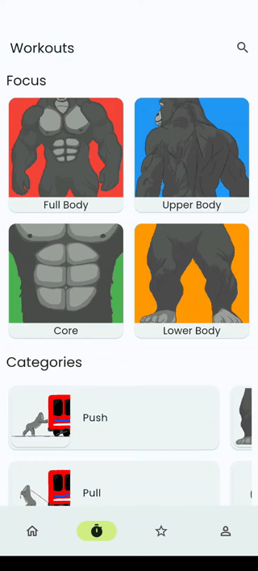
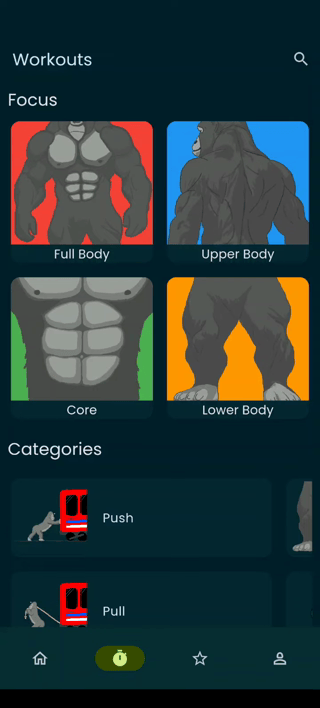

# 🦍 Gorilla Workout — Mobile App Showcase

  
  &nbsp;
  
  &nbsp;
  

> **Note:** The core source code for this application is proprietary as it is a live, commercial product on the Google Play Store. This repository serves as a technical showcase.

## 📌 Project Overview
**Gorilla Workout** is a comprehensive Street Workout and Calisthenics mobile application developed entirely from scratch using **Flutter**. 

As a **solo developer**, I managed the complete software lifecycle—from UI/UX design and custom character animations to database architecture and Google Play deployment. The application provides professional training programs, exercise tracking, and a seamless user experience tailored for bodyweight athletes.

---

## 🛠️ Software Architecture & Features

### 1. Full-Stack Execution & Data Management
Handled frontend mobile development and backend database structuring. Integrated a robust database system to efficiently store, retrieve, and display structured workout programs and user progress. 

  
  &nbsp;
  
  &nbsp;
  

### 2. Dynamic Theming (Light/Dark) & Scalable Localization (i18n)
Architected a highly responsive UI featuring dynamic Light and Dark modes to enhance user experience. Additionally, the app utilizes a scalable multi-language system. Currently supporting fully localized English and Turkish (including all complex exercise descriptions), with a codebase designed for rapid integration of future languages.

  
  &nbsp;&nbsp;&nbsp;&nbsp;&nbsp;&nbsp;
  

### 3. End-to-End Product Ownership
Built a clean, intuitive interface using Flutter's widget tree, ensuring smooth 60 FPS performance. Designed and animated every character, movement description, and UI element independently without relying on pre-made assets.

---

## 📬 Contact
* **Email:** [omerfaruk.kus@outlook.com](mailto:omerfaruk.kus@outlook.com)
* **LinkedIn:** [linkedin.com/in/omrfrkkus](https://linkedin.com/in/omrfrkkus)
